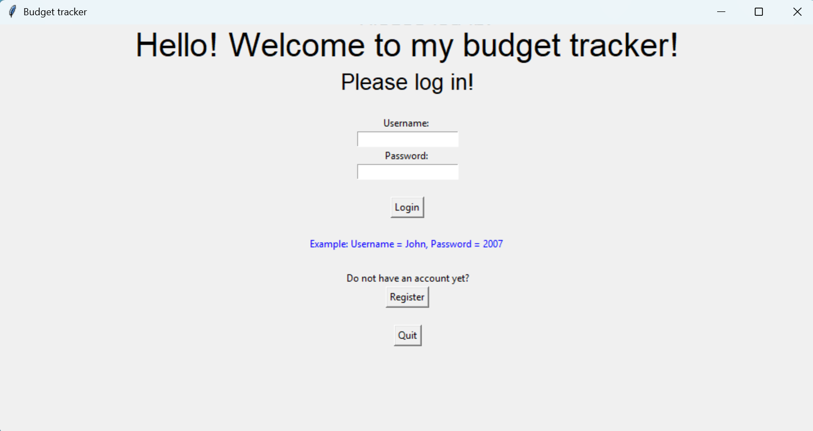
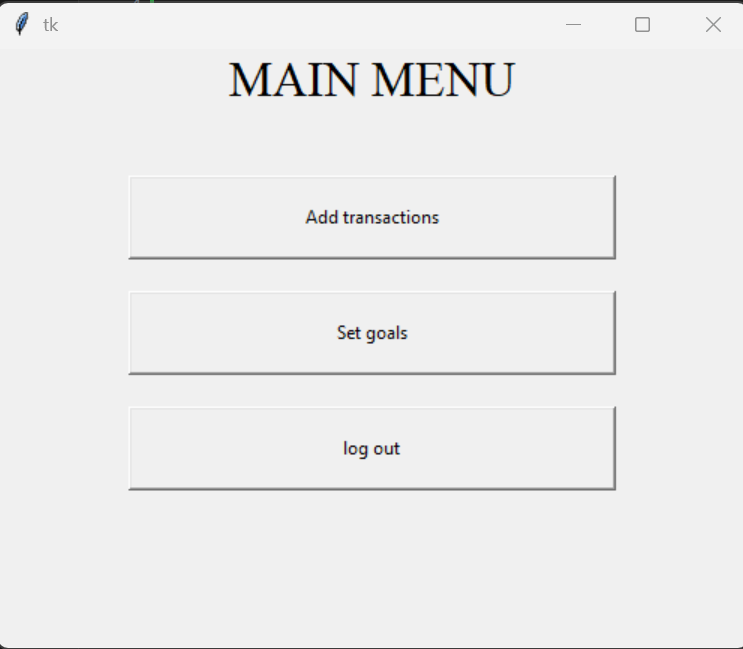
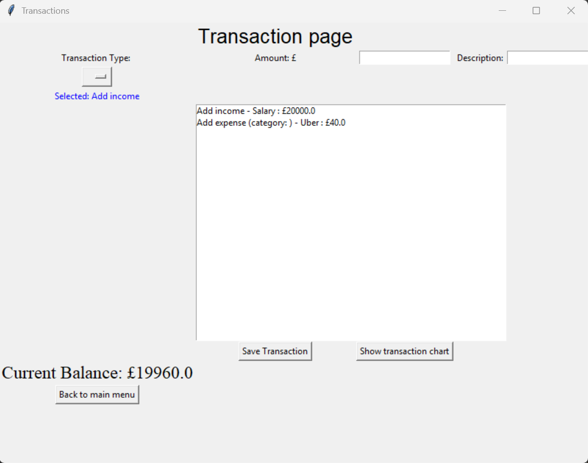
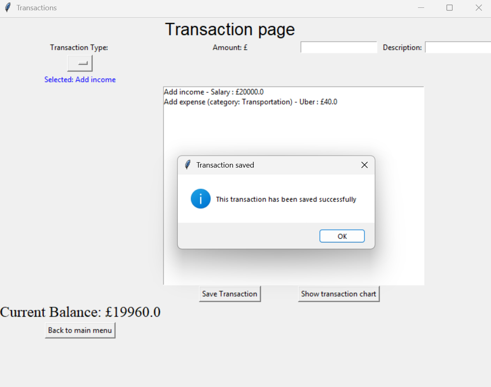
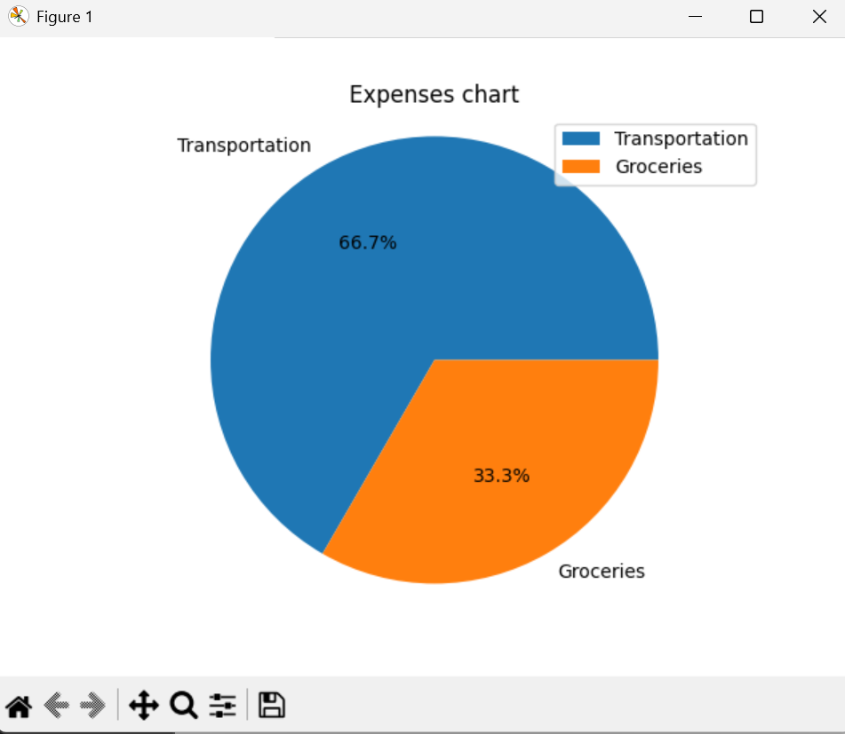
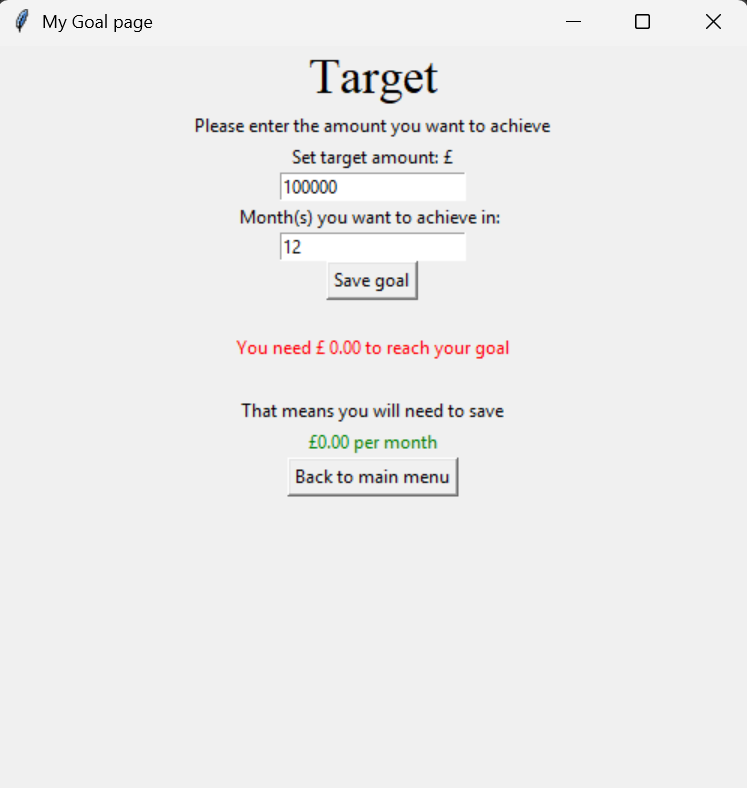
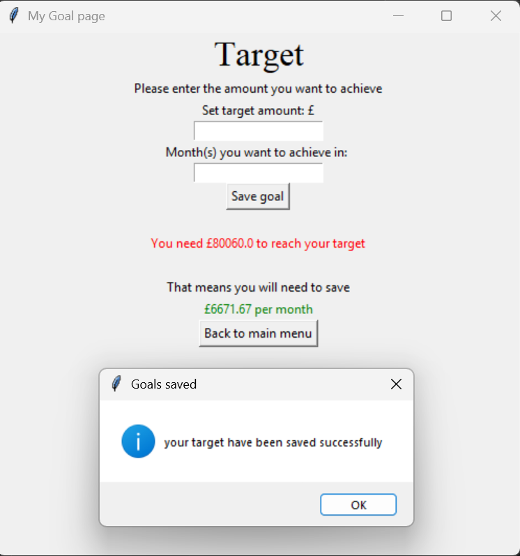
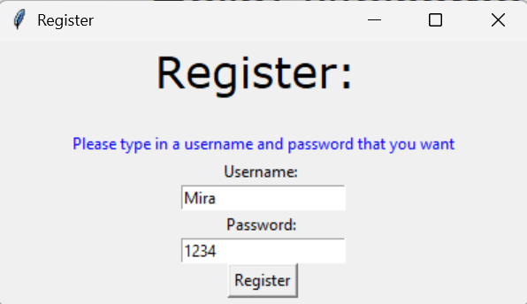
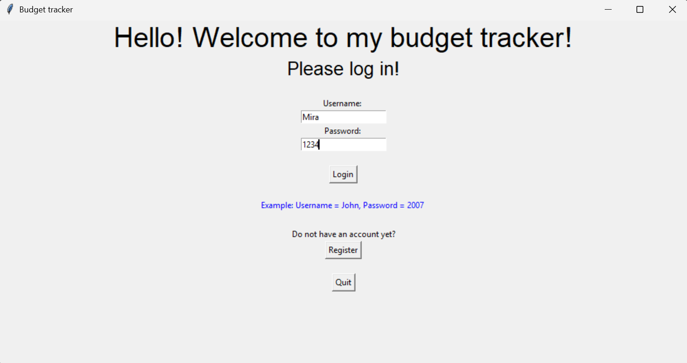

# Personal-Budget-Tracker

Hello! Welcome to my Budget Tracker! This program allows you to track your own balance and set your own goals. To run this program, type in python assessment_mainpage.py in the terminal

## Demo

This is what will show up when you first run the code. There is an example username and password that you can use,
or you can register a new user.

When you logged in, you will be directed to the main menu. This is what will show up. You can can choose to add transactions, set your goals or log out.

In the transaction page, you can choose whether to add income or expenses. You can enter in the amount and its description and then save your transaction.

If it is successfully saved, it will show up in the box below and your current balance will update. Additionally, if you choose to add expense, you can also choose their category.

When you click on show transaction chart, it will show a pie chart based on the user's expenses and how much they spend in each expenses categories.

In the set goal page, you can enter in the target amount that you want to reach and the months you want to reach your goal in.

When you click save goal, it will tell you how much you will need to reach your goal based on your current balance and how much you need to save per month.

Back to the login page, you can register a new user. You will not be able to log in a new user if you haven't register one. 

Once you've successfully registered, this message box will pop up.

Now you can log in with the new user!

Log in successful!

